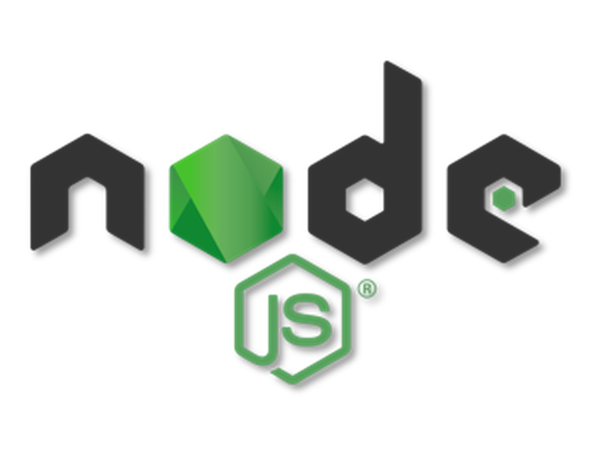

# ws-echo

ws-echo is a simple WebSocket echo server built with Node.js and the Socket.IO library. It allows you to test WebSocket connections by echoing back the received messages.

## Installation

To use ws-echo, you need to have Node.js and pnpm installed on your machine. Then, follow these steps:

1. Clone the repository:

   ```shell
   git clone https://github.com/T0R0NT0T0KY0/ws-echo.git
   ```

2. Navigate to the project directory:

   ```shell
   cd ws-echo
   ```

3. Install the dependencies using pnpm:

   ```shell
   pnpm install
   ```

## Usage

To start the ws-echo server, run the following command in the project directory:

```shell
pnpm start:dev
```

The server will start running on `localhost` at port `3000`.

## Testing the WebSocket Connection

You can test the WebSocket connection using a WebSocket client like `wscat` or any other WebSocket testing tool.

Here's an example of using `wscat` to connect to ws-echo server:

1. Install `wscat` globally:

   ```shell
   pnpm install -g wscat
   ```

2. Connect to ws-echo server:

   ```shell
   wscat -c ws://localhost:3000
   ```

   You should see a message indicating that the connection is established.

3. Start sending messages:

   Type any message in the terminal and press Enter. The server will echo back the received message.

4. Disconnect from the server:

   Press `Ctrl+C` to terminate the `wscat` session and close the WebSocket connection.

## Grafana Prometheus

<div align="center">
  <a href="https://grafana.com/" target="blank">
   
</a>
  <a href="https://prometheus.io/" target="blank">

</a>
  <a href="https://nodejs.org/" target="blank">

</a>
</div>

1) start docker compose
```
   docker-compose -f ./ci-cd/docker-compose.yml
```


2) [Node](http://localhost:3000/metrics) Metrics


3) [Prometheus](http://localhost:9090/targets) Targets Endpoint


4) [Grafana](http://localhost:8080/) Create Dashboard

Для входа логин: user / пароль: password
В примере мониторим загруженность CPU, оперативной памяти и event loop lag. 


## License

This project is licensed under the MIT License. See the [LICENSE](LICENSE) file for details.

## Telegram Notification

use `appleboy/telegram-action` for [github action](.github/workflows/nodejs.yml) notification.
Для быстрого получения информации о ci/cd в удобном месте


---

Enjoy using ws-echo for WebSocket testing with Socket.IO! If you have any questions or need assistance, feel free to
reach out.
